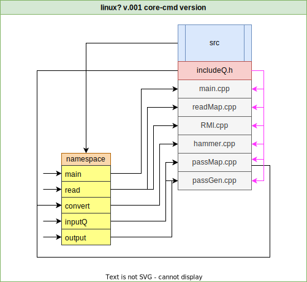

# HyperSSG
Intuitive intuitive GUI for simple xml display is simple and clear. (core)

At the moment, a GUI application is being created that can help you read xml, json and markup languages not in a text editor. 
This is the v.001 compiler of all possible markup languages in the SSG markup language...
------------------------------------------------------------------------------------------------------------
## About diagram

|On Linux:|
|:---------:|
|run ``` bash diag.sh ```|


|On Windows:|
|:------------:|
|...|

------------------------------------------------------------------------------------------------------------

Project is incredibly simple, the project structure in the diagram will always be in readme.md:



<!---
btw, there is always a file in the initial section.draw io with this diagram, you can always tweak it)
-->
